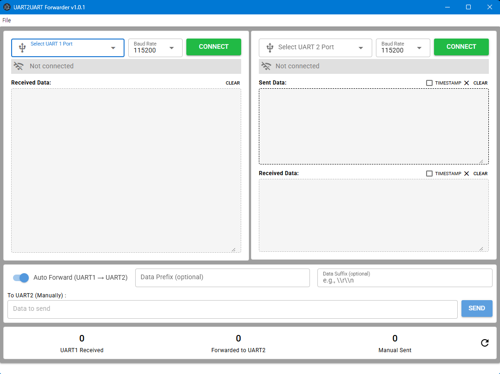

# UART to UART Forwarding Tool

A production tool designed for mass manufacturing environments. This application reads data from one UART port (e.g., QR code scanner output or sensor data) and forwards it to another UART port with optional data processing, prefix/suffix addition, and command formatting. The tool is specifically useful for writing serial numbers or configuration data to products during mass production processes.

## Features

- **Dual UART Mode**: Connect two serial ports for automated data forwarding
- **Single UART Mode**: Direct control of one serial port with macro transmission
- **Data Processing**: Add custom prefix and suffix to forwarded data
- **Transmit Macros**: Pre-configured commands with auto-transmission support
- **Timestamp Display**: Optional timestamp display for received/sent data
- **Configuration Management**: Save and load port settings and macro configurations
- **Real-time Monitoring**: Live display of all UART communication

## Use Cases

- Writing serial numbers to products via QR code scanning during mass production
- Automated product configuration and testing
- Serial data forwarding with protocol conversion
- Manufacturing test equipment integration

## Install the dependencies

```bash
yarn
# or
npm install
```

### Start the app in development mode (hot-code reloading, error reporting, etc.)

```bash
quasar dev
```

### Lint the files

```bash
yarn lint
# or
npm run lint
```

### Format the files

```bash
yarn format
# or
npm run format
```

### Add electron-builder

yarn add --dev electron-builder

### Build the app for production

```bash
quasar build  -m electron
quasar dev -m electron
```

### Screen Shot



### Customize the configuration

See [Configuring quasar.config.js](https://v2.quasar.dev/quasar-cli-vite/quasar-config-js).

## For STM8xxx Firmware writing

https://github.com/chcbaram/stm8flash_win/releases/tag/1.0.0

https://github.com/chcbaram/stm8flash_win?utm_source=chatgpt.com
